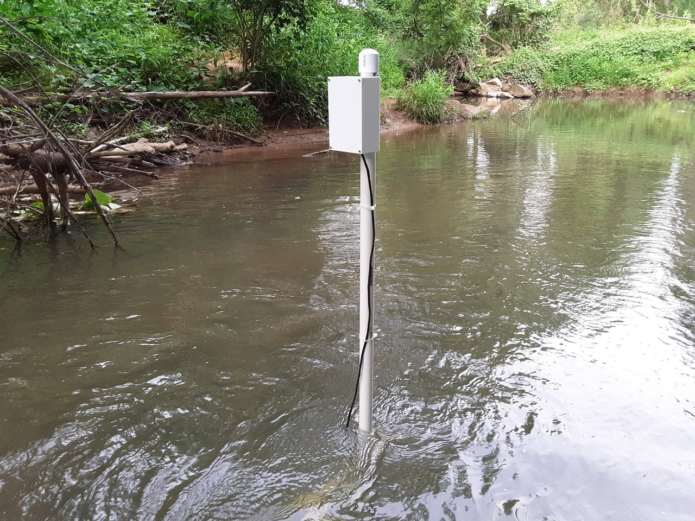

# iot-flow-meter
This repository contains the code and tutorial for buiding an IoT enabled flow meter. This project was submitted to Hackster.io as part of the [Cellular IoT Challenge](https://www.hackster.io/contests/soracomcontest#category-331), where it was selected as the grand prize winner. See the Hackster.io project page [here](https://www.hackster.io/rhammell/river-monitoring-with-an-iot-flow-meter-9af852).

# Overview

  
   
  <i>IoT flow meter deployed to a local river</i>

This project demonstrates how to build an internet connected flow meter that continuously measures a river's flow rate and makes real-time data available to users online.

The system can be deployed to remote rivers with a one-time setup, and can be left to run on its own, automatically collecting data without the need for users to be present. Multiple meters can be placed throughout a river to collect many points of data.

Measurement data is pushed to the cloud through the system's cellular network connectivity, enabled by a Soracom Global SIM card, and can be viewed online through Soracom Harvest. AWS IoT and CloudWatch services are used to send email notifications to users when the river's flow rate reaches a critical level.

# Background

  

The flow rate of a river measures the volume of water that passes through a specific point over time. This rate rises and falls as water from rainfall flows in and out of the river system.

Measuring a river's flow rate can yield valuable information for a variety purposes:

- Hydrology: Long term trends in flow rate give insights into the watershed system that feeds the river and how it changes over time.
- Ecology: Speed of river water determines if it can support different species of plants or animals.
- Flood Warning: Spikes in the flow rate can give early warning for incoming flooding and can be correlated to rainfall reports.
- Recreation Safety: Real-time measurements can warn canoers/kayakers if it is safe to travel along the river.

Currently, measuring the flow rate of remote river areas is a very hands-on process. Surveyors need to hike out to the river of interest carrying their measuring equipment, set it up, take a measurement, disassemble it, and hike back.

Because of the effort required to collect a measurement, it is only done periodically for certain rivers. Without continuous monitoring many of the insights that flow rate provides are lost.

This project aims to solve this problem by making flow rate data easier to collect and more readily available to users who need it.

# How it Works

  

  

The IoT flow meter consists of a sensor and electronics, connected to a PVC pipe support structure, that can be deployed to a river to collect flow rate data.

A flow meter sensor is connected to the structure's vertical pipe at an adjustable height where it is held submerged underwater. The electronics are contained in an upper housing at the top of the structure outside of the water.

