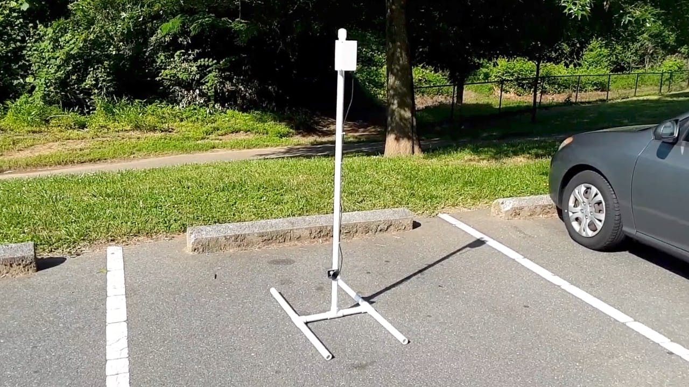
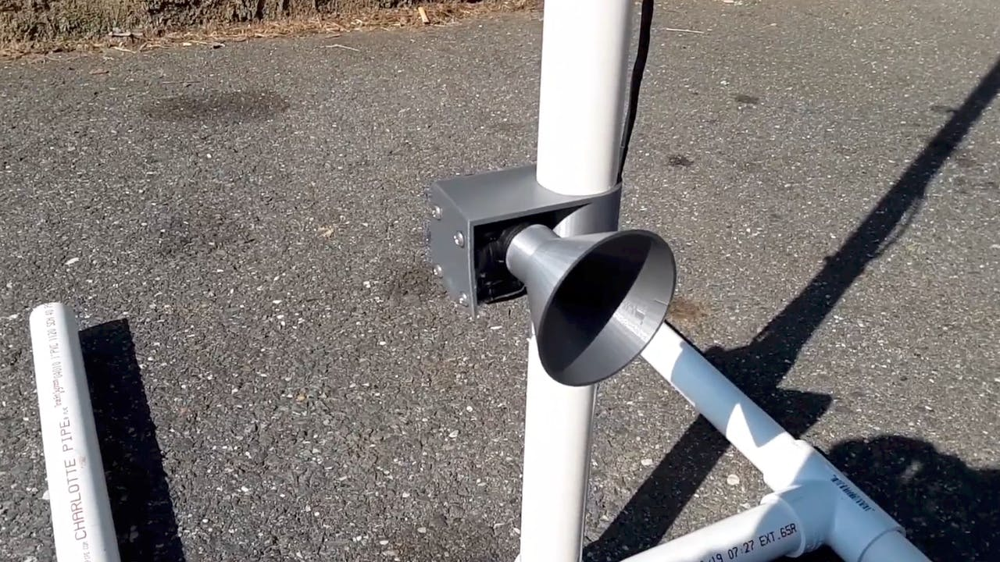

# iot-flow-meter
This repository contains the code and tutorial for buiding an IoT enabled flow meter. This project was submitted to Hackster.io as part of the [Cellular IoT Challenge](https://www.hackster.io/contests/soracomcontest#category-331), where it was selected as the grand prize winner. See the Hackster.io project page [here](https://www.hackster.io/rhammell/river-monitoring-with-an-iot-flow-meter-9af852).

# Overview

  
   
  <i>IoT flow meter deployed to a local river</i>

This project demonstrates how to build an internet connected flow meter that continuously measures a river's flow rate and makes real-time data available to users online.

The system can be deployed to remote rivers with a one-time setup, and can be left to run on its own, automatically collecting data without the need for users to be present. Multiple meters can be placed throughout a river to collect many points of data.

Measurement data is pushed to the cloud through the system's cellular network connectivity, enabled by a Soracom Global SIM card, and can be viewed online through Soracom Harvest. AWS IoT and CloudWatch services are used to send email notifications to users when the river's flow rate reaches a critical level.

# Background

  

The flow rate of a river measures the volume of water that passes through a specific point over time. This rate rises and falls as water from rainfall flows in and out of the river system.

Measuring a river's flow rate can yield valuable information for a variety purposes:

- Hydrology: Long term trends in flow rate give insights into the watershed system that feeds the river and how it changes over time.
- Ecology: Speed of river water determines if it can support different species of plants or animals.
- Flood Warning: Spikes in the flow rate can give early warning for incoming flooding and can be correlated to rainfall reports.
- Recreation Safety: Real-time measurements can warn canoers/kayakers if it is safe to travel along the river.

Currently, measuring the flow rate of remote river areas is a very hands-on process. Surveyors need to hike out to the river of interest carrying their measuring equipment, set it up, take a measurement, disassemble it, and hike back.

Because of the effort required to collect a measurement, it is only done periodically for certain rivers. Without continuous monitoring many of the insights that flow rate provides are lost.

This project aims to solve this problem by making flow rate data easier to collect and more readily available to users who need it.

# How it Works

  
   
  <i>IoT Flow Meter Overview Video</i>

The IoT flow meter consists of a sensor and electronics, connected to a PVC pipe support structure, that can be deployed to a river to collect flow rate data.

A flow meter sensor is connected to the structure's vertical pipe at an adjustable height where it is held submerged underwater. The electronics are contained in an upper housing at the top of the structure outside of the water.

    
    
    

  
   
  <i>IoT flow meter structure and components</i>

  
   
  <i>Flow meter sensor connected to structure</i>

  
   
  <i>IoT flow meter deployed to a local river</i>

The system utilizes a YF-S201 liquid flow meter sensor, which contains a magnetic pinwheel that is spun by incoming water.

As more water enters the sensor the wheel spins faster, and this rate of spin (Hz) can be used to calculate how many liters of water flow through the sensor per minute (L/min), called the flow rate.

    
    
    

Note: This flow rate only tells the liters of water passing through the sensor itself, not the entire river. The sensor's flow rate is strongly correlated to the river's actual flow rate, but is not measuring it directly. The IoT flow meter provides only the sensor's flow rate and uses this as an approximation for the entire river.

A 3D printed bracket is used to connect the sensor to the PVC pipe structure and a 3D printed funnel guides river water into the mouth of the sensor.

The electronics of the system include a Raspberry Pi, 3G USB modem with a Soracom Global SIM, and external battery, which are contained in a 3D printed housing. The sensor is connected to the Pi by water-sealed jumper wires that run the length of the vertical pipe into the housing.

    
    

The Pi runs a Python script where ever minute a flow rate measurement is collected from the sensor and, using the cellular connectivity provided by the modem and SIM card, pushed to the cloud.

The script makes an HTTP POST request to Soracom's Unified Endpoint which forwards the data along to two services: Soracom Harvest and Soracom Funnel.

    

Soracom Harvest allows for easy real-time visualization of the incoming data. The console displays a live graph showing updated data values as they stream in. Users can monitor how the data changes over a selected window of time.

    
    
    

Soracom Funnel takes the data and forwards it further on it by sending it to an AWS IoT endpoint, where an AWS IoT rule is then used to push the data to AWS CloudWatch.

A CloudWatch alarm is configured to monitor when the flow rate surpasses a critical value and automatically sends out an email notification to any subscribed users letting them know that the alarm has been triggered. This feature allows users to stay aware of important changes in the river's flow rate without having to monitor it live.

# Architecture and Operational Excellence

The IoT flow meter is meant to be a solution to a problem that traditionally requires more hands-on, expensive equipment to collect data. While this prototype has shown that it can be fielded and provide results, there are further things to consider in moving to a production version.

Cost: The total cost for the system is ~$120, with the largest expenses being the Raspberry Pi ($35) and the 3G Modem ($60). This price could likely brought down with bulk supplies. This total cost is reasonable when considering the man-hours saved by using this IoT device instead of paying surveyors/engineers to collect measurements manually.

Scalability: The system could be scaled up to many more units depending on demand. Building a mass amount of units would become easier by transitioning to an pre-fabricated circuit that contained all necessary electronics, and developing a better pipe structure that was pre-assembled.

If scaled up to 1000's of units running worldwide, Soracom and AWS IoT could still remain the backbone of how data is collected and distributed. Individual accounts and access may need to be set up for each user, and AWS IoT can accomplish this though IAM user groups, which grant permissions to view/edit data to only specific users.

Reliability: Consistent and accurate measurements that reflect the actual flow rate is important to this problem. More testing needs to be done to better understand the different effects that may influence the sensor's readings like depth and placement in the river.

The system relies on having a reliable cellular network as well. Currently, if an attempted request to Soracom fails due to a network timeout, that data is lost. Further updates to the tool would include backing up measurements so they could be saved and pushed to the cloud when the connection is reestablished.

Security: The IoT flow meter is designed to be left unattended, which puts its physical security at risk. Currently, there is no way to determine what happens to the system if it goes offline or is missing, but a future version may include a GPS module that includes the system's current coordinates with each data push. This would help track the location of the system at any time.

